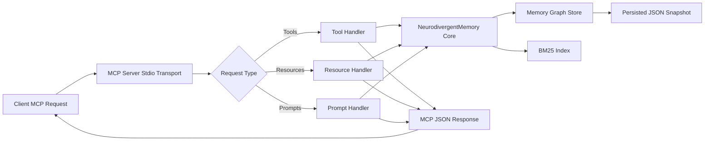

# neurodivergent-memory MCP Server

[](https://www.npmjs.com/package/neurodivergent-memory)
[](https://hub.docker.com/r/twgbellok/neurodivergent-memory)
[](https://opensource.org/licenses/MIT)
[](https://nodejs.org/en/about/previous-releases)

<table>
  <tr>
    <td width="360" valign="top">
      <details>
        <summary>📽️ Click to preview</summary>
        <br />
        <a href="https://raw.githubusercontent.com/jmeyer1980/neurodivergent-memory/main/neurodivergent-memory.gif">
          
        </a>
      </details>
    </td>
    <td valign="top">
      <p><strong>Project Preview</strong></p>
      <p>
        This is a Model Context Protocol server for knowledge graphs designed around neurodivergent thinking patterns.
      </p>
      <p>
        This TypeScript-based MCP server implements a memory system inspired by neurodivergent cognitive styles. It organizes thoughts into five <strong>districts</strong> (knowledge domains), ranks search results using <strong>BM25 semantic ranking</strong>, and stores memories as a persistent knowledge graph with bidirectional connections.
      </p>
    </td>
  </tr>
</table>

## Model Flow



Flow notes:

- Memory operations update both graph state and BM25 index.
- Persistence writes to the local snapshot file for restart continuity.
- All MCP responses return through stdio transport.

## Features

### Five Memory Districts

Memories are organized by cognitive domain:

- **logical_analysis** — Structured thinking, problem solving, and analytical processes
- **emotional_processing** — Feelings, emotional responses, and affective states
- **practical_execution** — Action-oriented thoughts, tasks, and implementation
- **vigilant_monitoring** — Awareness, safety concerns, and protective thinking
- **creative_synthesis** — Novel connections, creative insights, and innovative thinking

### Resources

- Explore memory districts and individual memories via `memory://` URIs
- Each memory includes content, tags, emotional metadata, and connection information
- Access memories as JSON resources with full metadata

### Tools (11 memory management operations)

- **`store_memory`** — Create new memory nodes with optional emotional valence and intensity
- **`retrieve_memory`** — Fetch a specific memory by ID and increment access count
- **`update_memory`** — Modify content, tags, district, emotional_valence, or intensity
- **`delete_memory`** — Remove a memory and all its connections
- **`connect_memories`** — Create bidirectional edges between memory nodes
- **`search_memories`** — BM25-ranked semantic search with optional filters (district, tags, emotional valence, intensity, min_score)
- **`traverse_from`** — Graph traversal up to N hops from a starting memory
- **`related_to`** — Find memories by graph proximity + BM25 semantic blend
- **`list_memories`** — Paginated listing with optional district/archetype filters
- **`memory_stats`** — Aggregate statistics (totals, per-district counts, most-accessed, orphans)
- **`import_memories`** — Bulk-seed memories from JSON array

### Prompts

- **`explore_memory_city`** — Guided exploration of districts and memory organization
- **`synthesize_memories`** — Create new insights by connecting existing memories

## Core Concepts

### Memory Archetypes

Each memory is assigned an archetype tied to its district:

- **scholar** — logical_analysis
- **merchant** — practical_execution
- **mystic** — emotional_processing and creative_synthesis
- **guard** — vigilant_monitoring

### Semantic Ranking

Search uses **Okapi BM25** ranking (k1=1.5, b=0.75) without requiring embeddings or cloud calls. Results are normalized to 0–1 score range.

### Emotional Metadata

Each memory can optionally carry:

- **emotional_valence** (-1 to 1) — Emotional charge or affective tone
- **intensity** (0–1) — Mental energy or importance weight

### Knowledge Graph Persistence

Memories are persisted with a write-ahead journal (WAL) plus snapshot model:

- Every mutating operation appends to `memories.json.wal.jsonl` first.
- The in-memory graph is then updated and periodically snapshotted to `memories.json`.
- On startup, the server loads `memories.json`, replays WAL entries, compacts to a fresh snapshot, then truncates the WAL.

This improves crash recovery behavior compared to snapshot-only persistence.

For explicit control, set one of these environment variables:

- `NEURODIVERGENT_MEMORY_DIR` to choose the directory that contains `memories.json`
- `NEURODIVERGENT_MEMORY_FILE` to point at a specific snapshot file
- `NEURODIVERGENT_MEMORY_MAX` to cap total memories (integer; default unlimited)
- `NEURODIVERGENT_MEMORY_EVICTION` to choose eviction policy when max is reached:
  - `lru` (default)
  - `access_frequency`
  - `district_priority`

Mounts at `/home/node/.neurodivergent-memory` continue to work without any env override — that is the container's `node` user home and is checked automatically.

> **⚠️ Breaking change (v0.1.9):** The image runs as the `node` user and **cannot read `/root`**, so previous mounts at `/root/.neurodivergent-memory` are silently skipped. Agents may appear to have lost all memories. See [Recovering memories after upgrade](#recovering-memories-after-upgrade) below.

#### Recovering memories after upgrade

If you previously mounted data at `/root/.neurodivergent-memory`, your snapshot is still intact on the host volume. Re-mount it using one of these options:

**Option A — explicit `/data` mount (recommended):**

```json
"-e", "NEURODIVERGENT_MEMORY_DIR=/data",
"-v", "mydata:/data"
```

**Option B — mount at the path the `node` user already owns:**

```json
"-v", "mydata:/home/node/.neurodivergent-memory"
```

No `NEURODIVERGENT_MEMORY_DIR` override is needed for option B — the server finds the existing snapshot automatically.

For agents: if memories appear missing after upgrading the container, use `import_memories` to reload from a backup export, or ask your AI assistant to re-run `memory_stats` after the volume is remounted correctly to confirm restoration.

## Release Security

- GitHub Actions runs on **Node.js 24 LTS** for CI and release automation
- npm publishes use **OIDC provenance** with `npm publish --provenance --access public`
- Docker images are built with **Buildx**, published to Docker Hub, and emitted with **SBOM** and **provenance** metadata
- GitHub Actions generates **artifact attestations** for the npm tarball and the pushed container image digest
- Tagged releases upload the npm tarball, checksums, and attestation bundles as release assets

## Development RC Channel

Pushes to the `development` branch publish **release candidates** using the same npm package name (`neurodivergent-memory`) and container repositories.

- npm prereleases are published as `0.x.x-rc.N` with npm dist-tag `rc`.
- npm prerelease suffix `N` uses `run_number.run_attempt` to avoid collisions on workflow re-runs.
- Docker images are published with `rc-0.x.x` (moving) and `rc-0.x.x-rc.N` tags, where `N` is derived from `run_number.run_attempt` (immutable per run attempt).
- GitHub releases for RC builds are marked as **pre-release**.

These builds are intentionally less stable than the research preview line and should be used only for validation and early integration testing.

## Error Contract

Mutating and lookup tool failures are returned with a stable operator-facing shape embedded in the text response:

```text
❌ <summary>
Code: NM_EXXX
Message: Human-readable failure summary
Recovery: Suggested next action
```

The leading summary line is contextual, while the `Code`/`Message`/`Recovery` block remains stable for operators to parse and search. This keeps MCP responses readable in chat clients while giving operators a stable code they can search in logs and release notes. Structured logs are written with Pino to stderr and include the same `code` field on known failure paths.

## Concurrency Safety

Mutating tools are serialized through an async mutex to prevent concurrent write races when multiple agents call the server at the same time.

Write queue behavior:

- Pending write operations are bounded by `NEURODIVERGENT_MEMORY_QUEUE_DEPTH` (default: `50`).
- When the queue is full, mutating tools return `NM_E010` with a retry-oriented recovery message.
- Queue high-water/clear transitions are logged with structured Pino warnings.

WIP guardrail behavior:

- `store_memory` checks practical in-progress task saturation per `agent_id` when task tags include in-progress markers.
- The cap is controlled by `NEURODIVERGENT_MEMORY_WIP_LIMIT` (default: `1`; set `0` to disable).
- Exceeding the cap emits a warning line in the tool response and logs `NM_E011` for operator visibility.

## Loop Telemetry (Observe-Only)

The server now tracks loop signals without blocking behavior changes:

- Repetition detection on `store_memory` compares incoming content against the 10 most recent memories (same `agent_id` when provided) using normalized BM25 scoring.
- Stores that meet the repeat threshold set `repeat_detected: true` in the tool response and increment `repeat_write_count` on the matched memory.
- Read/write ping-pong transitions are tracked in a rolling operation window and increment `ping_pong_counter` when threshold conditions are met.
- `memory_stats` now includes a `loop_telemetry` block with:
  - `repeat_write_candidates` (top 5)
  - `ping_pong_candidates` (top 5)
  - `recent_high_similarity_writes` (last 5)

Configuration:

- `NEURODIVERGENT_MEMORY_REPEAT_THRESHOLD` (default: `0.85`)
- `NEURODIVERGENT_MEMORY_LOOP_WINDOW` (default: `20`)
- `NEURODIVERGENT_MEMORY_PING_PONG_THRESHOLD` (default: `3`)

## Performance Benchmark Baseline

Issue #19 adds a deterministic benchmark harness for end-to-end MCP stdio measurements against the built server.

Run it with:

```bash
npm run benchmark
```

The benchmark:

- Uses an isolated temp persistence directory so it does not mutate your local memory graph.
- Measures `store_memory` throughput plus `search_memories`, `list_memories`, and `related_to` latency at 1k, 5k, and 10k memories.
- Writes raw and Markdown outputs to:
  - `benchmark-results/memory-benchmark-baseline.json`
  - `benchmark-results/memory-benchmark-baseline.md`

The committed baseline is intended as a relative regression reference for RC vs stable comparisons, not as a universal absolute performance guarantee across machines.

## Development

Install dependencies:

```bash
npm install
```

Build the server:

```bash
npm run build
```

For development with auto-rebuild:

```bash
npm run watch
```

## Installation

To use with Claude Desktop, add the server config:

On MacOS: `~/Library/Application Support/Claude/claude_desktop_config.json`
On Windows: `%APPDATA%/Claude/claude_desktop_config.json`

For npm:

```json
{
  "mcpServers": {
    "neurodivergent-memory": {
      "command": "npx",
      "args": ["neurodivergent-memory"]
    }
  }
}
```

For Docker:

```json
{
  "mcpServers": {
    "neurodivergent-memory": {
      "command": "docker",
      "args": [
        "run",
        "-i",
        "--rm",
        "-e",
        "NEURODIVERGENT_MEMORY_DIR=/data",
        "-v",
        "neurodivergent-memory-data:/data",
        "docker.io/twgbellok/neurodivergent-memory:latest"
      ]
    }
  }
}
```

Fully auto-approved tools:

```json
{
  "mcpServers": {
    "neurodivergent-memory": {
      "autoApprove": [
        "store_memory",
        "retrieve_memory",
        "connect_memories",
        "search_memories",
        "update_memory",
        "delete_memory",
        "traverse_from",
        "related_to",
        "list_memories",
        "memory_stats",
        "import_memories"
      ],
      "disabled": false,
      "timeout": 120,
      "type": "stdio",
      "command": "docker",
      "args": [
        "run",
        "-i",
        "--rm",
        "-e",
        "NEURODIVERGENT_MEMORY_DIR=/data",
        "-v",
        "neurodivergent-memory-data:/data",
        "docker.io/twgbellok/neurodivergent-memory:latest"
      ],
      "env": {}
    }
  }
}
```

If you want per-project isolation instead of a shared global memory file, mount a project-specific host directory and keep the same container-side target. Use the path separator for your OS:

- **Windows**: `${workspaceFolder}\.neurodivergent-memory:/data`
- **macOS / Linux**: `${workspaceFolder}/.neurodivergent-memory:/data`

```json
{
  "mcpServers": {
    "neurodivergent-memory": {
      "command": "docker",
      "args": [
        "run",
        "-i",
        "--rm",
        "-e",
        "NEURODIVERGENT_MEMORY_DIR=/data",
        "-v",
        "${workspaceFolder}/.neurodivergent-memory:/data",
        "docker.io/twgbellok/neurodivergent-memory:latest"
      ]
    }
  }
}
```

> **Note:** Replace `/` with `\` on Windows: `${workspaceFolder}\.neurodivergent-memory:/data`

### Docker Runtime

You can also run the packaged server image directly:

```bash
docker run --rm -i twgbellok/neurodivergent-memory:latest
```

### Debugging

Since MCP servers communicate over stdio, debugging can be challenging. We recommend using the [MCP Inspector](https://github.com/modelcontextprotocol/inspector), which is available as a package script:

```bash
npm run inspector
```

The Inspector will provide a URL to access debugging tools in your browser.
