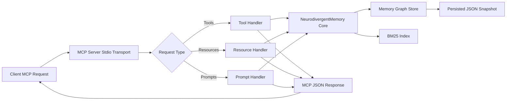

# neurodivergent-memory MCP Server

[](https://www.npmjs.com/package/neurodivergent-memory)
[](https://hub.docker.com/r/twgbellok/neurodivergent-memory)
[](https://opensource.org/licenses/MIT)
[](https://nodejs.org/en/about/previous-releases)

<table>
  <tr>
    <td width="360" valign="top">
      <details>
        <summary>📽️ Click to preview</summary>
        <br />
        <a href="https://raw.githubusercontent.com/jmeyer1980/neurodivergent-memory/main/neurodivergent-memory.gif">
          
        </a>
      </details>
    </td>
    <td valign="top">
      <p><strong>Project Preview</strong></p>
      <p>
        This is a Model Context Protocol server for knowledge graphs designed around neurodivergent thinking patterns.
      </p>
      <p>
        This TypeScript-based MCP server implements a memory system inspired by neurodivergent cognitive styles. It organizes thoughts into five <strong>districts</strong> (knowledge domains), ranks search results using <strong>BM25 semantic ranking</strong>, and stores memories as a persistent knowledge graph with bidirectional connections.
      </p>
    </td>
  </tr>
</table>

## Model Flow



Flow notes:

- Memory operations update both graph state and BM25 index.
- Persistence writes to the local snapshot file for restart continuity.
- All MCP responses return through stdio transport.

## Features

### Five Memory Districts

Memories are organized by cognitive domain:

- **logical_analysis** — Structured thinking, problem solving, and analytical processes
- **emotional_processing** — Feelings, emotional responses, and affective states
- **practical_execution** — Action-oriented thoughts, tasks, and implementation
- **vigilant_monitoring** — Awareness, safety concerns, and protective thinking
- **creative_synthesis** — Novel connections, creative insights, and innovative thinking

### Resources

- Explore memory districts and individual memories via `memory://` URIs
- Each memory includes content, tags, emotional metadata, and connection information
- Access memories as JSON resources with full metadata

### Tools (11 memory management operations)

- **`store_memory`** — Create new memory nodes with optional emotional valence and intensity
- **`retrieve_memory`** — Fetch a specific memory by ID and increment access count
- **`update_memory`** — Modify content, tags, district, emotional_valence, or intensity
- **`delete_memory`** — Remove a memory and all its connections
- **`connect_memories`** — Create bidirectional edges between memory nodes
- **`search_memories`** — BM25-ranked semantic search with optional filters (district, tags, emotional valence, intensity, min_score)
- **`traverse_from`** — Graph traversal up to N hops from a starting memory
- **`related_to`** — Find memories by graph proximity + BM25 semantic blend
- **`list_memories`** — Paginated listing with optional district/archetype filters
- **`memory_stats`** — Aggregate statistics (totals, per-district counts, most-accessed, orphans)
- **`import_memories`** — Bulk-seed memories from JSON array

### Prompts

- **`explore_memory_city`** — Guided exploration of districts and memory organization
- **`synthesize_memories`** — Create new insights by connecting existing memories

## Core Concepts

### Memory Archetypes

Each memory is assigned an archetype tied to its district:

- **scholar** — logical_analysis
- **merchant** — practical_execution
- **mystic** — emotional_processing and creative_synthesis
- **guard** — vigilant_monitoring

### Semantic Ranking

Search uses **Okapi BM25** ranking (k1=1.5, b=0.75) without requiring embeddings or cloud calls. Results are normalized to 0–1 score range.

### Emotional Metadata

Each memory can optionally carry:

- **emotional_valence** (-1 to 1) — Emotional charge or affective tone
- **intensity** (0–1) — Mental energy or importance weight

### Knowledge Graph Persistence

Memories are automatically persisted to `~/.neurodivergent-memory/memories.json` on every write. The graph is restored on server startup.

## Release Security

- GitHub Actions runs on **Node.js 20 LTS** for CI and release automation
- npm publishes use **OIDC provenance** with `npm publish --provenance --access public`
- Docker images are built with **Buildx**, published to Docker Hub, and emitted with **SBOM** and **provenance** metadata
- GitHub Actions generates **artifact attestations** for the npm tarball and the pushed container image digest
- Tagged releases upload the npm tarball, checksums, and attestation bundles as release assets

## Development

Install dependencies:

```bash
npm install
```

Build the server:

```bash
npm run build
```

For development with auto-rebuild:

```bash
npm run watch
```

## Installation

To use with Claude Desktop, add the server config:

On MacOS: `~/Library/Application Support/Claude/claude_desktop_config.json`
On Windows: `%APPDATA%/Claude/claude_desktop_config.json`

```json
{
  "mcpServers": {
    "neurodivergent-memory": {
      "command": "/path/to/neurodivergent-memory/build/index.js"
    }
  }
}
```

### Docker Runtime

You can also run the packaged server image directly:

```bash
docker run --rm -i twgbellok/neurodivergent-memory:latest
```

### Debugging

Since MCP servers communicate over stdio, debugging can be challenging. We recommend using the [MCP Inspector](https://github.com/modelcontextprotocol/inspector), which is available as a package script:

```bash
npm run inspector
```

The Inspector will provide a URL to access debugging tools in your browser.
