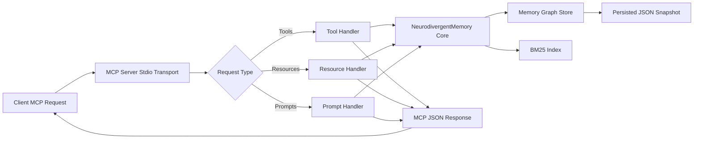

# neurodivergent-memory MCP Server

[](https://www.npmjs.com/package/neurodivergent-memory)
[](https://hub.docker.com/r/twgbellok/neurodivergent-memory)
[](https://opensource.org/licenses/MIT)
[](https://nodejs.org/en/about/previous-releases)

<table>
  <tr>
    <td width="360" valign="top">
      <details>
        <summary>📽️ Click to preview</summary>
        <br />
        <a href="https://raw.githubusercontent.com/jmeyer1980/neurodivergent-memory/main/neurodivergent-memory.gif">
          
        </a>
      </details>
    </td>
    <td valign="top">
      <p><strong>Project Preview</strong></p>
      <p>
        This is a Model Context Protocol server for knowledge graphs designed around neurodivergent thinking patterns.
      </p>
      <p>
        This TypeScript-based MCP server implements a memory system inspired by neurodivergent cognitive styles. It organizes thoughts into five <strong>districts</strong> (knowledge domains), ranks search results using <strong>BM25 semantic ranking</strong>, and stores memories as a persistent knowledge graph with bidirectional connections.
      </p>
      <blockquote>
        <p>
          <strong>Design note:</strong> The district model is rooted in <a href="https://gitlab.com/tiny-walnut-games/fractalstat">FractalSemantics (FractalStat)</a> addressing, where every entity inherits ancestry from a single anchor point called <strong>LUCA</strong> (Last Universal Common Ancestor). These concepts are also used in <a href="https://gitlab.com/tiny-walnut-games/the-seed/-/tree/4884b3a22da8a487e7c7931cb7426e20def0d7ba/warbler-cda-package">Warbler-CDA</a> and <a href="https://gitlab.com/tiny-walnut-games/the-seed">the seed</a>. The five canonical districts are the five direct children of LUCA in the default schema. Custom districts in later milestones must declare a valid LUCA-derived address, making ancestry explicit and traceable rather than assumed.
        </p>
      </blockquote>
    </td>
  </tr>
</table>

## Model Flow



Flow notes:

- Memory operations update both graph state and BM25 index.
- Persistence writes to the local snapshot file for restart continuity.
- All MCP responses return through stdio transport.

## Features

### Five Memory Districts

Memories are organized by cognitive domain:

- **logical_analysis** — Structured thinking, problem solving, and analytical processes
- **emotional_processing** — Feelings, emotional responses, and affective states
- **practical_execution** — Action-oriented thoughts, tasks, and implementation
- **vigilant_monitoring** — Awareness, safety concerns, and protective thinking
- **creative_synthesis** — Novel connections, creative insights, and innovative thinking

### Resources

- Explore memory districts and individual memories via `memory://` URIs
- Each memory includes content, tags, emotional metadata, and connection information
- Access memories as JSON resources with full metadata

### Tools (11 memory management operations)

- **`store_memory`** — Create new memory nodes with optional emotional valence and intensity
- **`retrieve_memory`** — Fetch a specific memory by ID
- **`update_memory`** — Modify content, tags, district, emotional_valence, intensity, or project attribution
- **`delete_memory`** — Remove a memory and all its connections
- **`connect_memories`** — Create bidirectional edges between memory nodes
- **`search_memories`** — BM25-ranked semantic search with optional goal context, recency bias, and filters (district, project_id, tags, emotional valence, intensity, min_score)
- **`traverse_from`** — Graph traversal up to N hops from a starting memory
- **`related_to`** — Find memories by graph proximity + BM25 semantic blend, with optional goal context boost
- **`list_memories`** — Paginated listing with optional district/archetype/project_id filters
- **`memory_stats`** — Aggregate statistics (totals, per-district/per-project counts, most-accessed, orphans) with optional project scope
- **`storage_diagnostics`** — Show the resolved snapshot path, WAL path, and effective persistence source in one response
- **`import_memories`** — Bulk-import from inline JSON entries or a snapshot `file_path`, with `dry_run`, dedupe policies, and explicit snapshot migration flags

### Prompts

- **`explore_memory_city`** — Guided exploration of districts and memory organization
- **`synthesize_memories`** — Create new insights by connecting existing memories
- **`synthesize_memory_packets`** — Packetized synthesis prompt for attachment-constrained clients; emits one coverage manifest plus bounded memory slices that summarize the broader graph

Use `synthesize_memories` when the MCP client can comfortably consume many raw memory resources. Use `synthesize_memory_packets` when the caller path is attachment-constrained or when you need broader graph coverage in a small number of structured resources.

## Core Concepts

### Memory Archetypes

Each memory is assigned an archetype tied to its district:

- **scholar** — logical_analysis
- **merchant** — practical_execution
- **mystic** — emotional_processing and creative_synthesis
- **guard** — vigilant_monitoring

### Semantic Ranking

Search uses **Okapi BM25** ranking (k1=1.5, b=0.75) without requiring embeddings or cloud calls. Results are normalized to 0–1 score range.

### Emotional Metadata

Each memory can optionally carry:

- **emotional_valence** (-1 to 1) — Emotional charge or affective tone
- **intensity** (0–1) — Mental energy or importance weight

### Project Attribution and Scoped Retrieval

Memories can optionally include a first-class `project_id` for attribution and scoped retrieval across multi-project graphs.

- `project_id` is optional on writes (`store_memory`, `update_memory`, `import_memories`).
- `update_memory` accepts `project_id: null` to clear existing project attribution.
- `search_memories`, `list_memories`, and `memory_stats` accept an optional `project_id` filter.
- `search_memories` accepts optional `context` and `recency_weight` parameters. Context is blended into ranking as a lightweight BM25 boost; `recency_weight` must be between `0` and `1` and adds a recency boost without replacing semantic relevance.
- `search_memories` accepts `min_intensity` / `max_intensity` as the preferred intensity filter names. The legacy `intensity_min` / `intensity_max` aliases remain supported for compatibility.
- `related_to` accepts an optional `context` parameter to bias related-memory ranking toward the caller's current goal.
- Stats now include a `perProject` breakdown.
- Scoped `memory_stats` reports `totalConnections` only for edges where both endpoints are in scope.
- `list_memories` includes a `project: ...` segment in each line (`unset` when no project attribution exists).
- Validation contract: `project_id` must match `^[A-Za-z0-9][A-Za-z0-9._:-]{0,63}$` (max length 64).
- Invalid values return stable error code `NM_E020` with recovery guidance.

### Import Diagnostics and Migration Semantics

`storage_diagnostics` reports the resolved snapshot path, the WAL path, and which configuration source won the persistence-path precedence check.

`import_memories` supports two source modes:

- Inline `entries` for ordinary bulk seeding.
- `file_path` for server snapshot imports, avoiding large MCP payloads.

Import validation flags:

- `dry_run: true` validates the request without writing data and returns deterministic `would_import`, `would_skip`, and `would_fail` counts.
- `dedupe` accepts `none`, `content_hash`, or `content_plus_tags`.
- Deduplicated rows are reported with stable reason codes: `DEDUPE_CONTENT_HASH` or `DEDUPE_CONTENT_PLUS_TAGS`.

Snapshot migration flags:

- `preserve_ids` is only valid with `file_path`; any ID collision with the live store is rejected deterministically.
- `merge_connections` is only valid with `file_path`; every referenced connection target must exist either in the imported snapshot or the live store, or the row fails validation with `INVALID_CONNECTION_TARGET`.
- If validation failures are present, the non-dry-run import is rejected as a whole. Run `dry_run: true` first to inspect the failure list before retrying.

### Knowledge Graph Persistence

Memories are persisted with a write-ahead journal (WAL) plus snapshot model:

- Every mutating operation appends to `memories.json.wal.jsonl` first.
- The in-memory graph is then updated and periodically snapshotted to `memories.json`.
- On startup, the server loads `memories.json`, replays WAL entries, compacts to a fresh snapshot, then truncates the WAL.

This improves crash recovery behavior compared to snapshot-only persistence.

For explicit control, set one of these environment variables:

- `NEURODIVERGENT_MEMORY_DIR` to choose the directory that contains `memories.json`
- `NEURODIVERGENT_MEMORY_FILE` to point at a specific snapshot file
- `NEURODIVERGENT_MEMORY_MAX` to cap total memories (integer; default unlimited)
- `NEURODIVERGENT_MEMORY_EVICTION` to choose eviction policy when max is reached:
  - `lru` (default)
  - `access_frequency`
  - `district_priority`

Mounts at `/home/node/.neurodivergent-memory` continue to work without any env override — that is the container's `node` user home and is checked automatically.

> **⚠️ Breaking change (v0.2.0):** The image runs as the `node` user and **cannot read `/root`**, so previous mounts at `/root/.neurodivergent-memory` are silently skipped. Agents may appear to have lost all memories. See [Recovering memories after upgrade](#recovering-memories-after-upgrade) below.

#### Recovering memories after upgrade

If you previously mounted data at `/root/.neurodivergent-memory`, your snapshot is still intact on the host volume. Re-mount it using one of these options:

**Option A — explicit `/data` mount (recommended):**

```json
"-e", "NEURODIVERGENT_MEMORY_DIR=/data",
"-v", "mydata:/data"
```

**Option B — mount at the path the `node` user already owns:**

```json
"-v", "mydata:/home/node/.neurodivergent-memory"
```

No `NEURODIVERGENT_MEMORY_DIR` override is needed for option B — the server finds the existing snapshot automatically.

For agents: if memories appear missing after upgrading the container, use `import_memories` to reload from a backup export, or ask your AI assistant to re-run `memory_stats` after the volume is remounted correctly to confirm restoration.

## Release Security

- GitHub Actions runs on **Node.js 24 LTS** for CI and release automation
- npm publishes use **OIDC provenance** with `npm publish --provenance --access public`
- Docker images are built with **Buildx**, published to Docker Hub, and emitted with **SBOM** and **provenance** metadata
- GitHub Actions generates **artifact attestations** for the npm tarball and the pushed container image digest
- Tagged releases upload the npm tarball, checksums, and attestation bundles as release assets

## Development RC Channel

Pushes to the `development` branch publish **release candidates** using the same npm package name (`neurodivergent-memory`) and container repositories.

- npm prereleases are published as `0.x.x-rc.N` with npm dist-tag `rc`.
- npm prerelease suffix `N` uses `run_number.run_attempt` to avoid collisions on workflow re-runs.
- Docker images are published with immutable `rc-0.x.x-rc.N` tags only, where `N` is derived from `run_number.run_attempt`.
- GitHub releases for RC builds are marked as **pre-release**.

These builds are intentionally less stable than the research preview line and should be used only for validation and early integration testing.

### Live Readiness Smoke (project_id)

Use the deterministic live smoke harness to validate `project_id` attribution/scoped retrieval end-to-end:

- Local build target:

```bash
npm run smoke:project-id
```

- Latest Docker RC target (PowerShell):

```powershell
$rc = (Invoke-RestMethod -Uri "https://hub.docker.com/v2/repositories/twgbellok/neurodivergent-memory/tags?page_size=25").results |
  Where-Object { $_.name -match '^rc-' } |
  Sort-Object { $_.last_updated } -Descending |
  Select-Object -First 1 -ExpandProperty name
node test/live-project-id-smoke.mjs "docker run --rm -i twgbellok/neurodivergent-memory:$rc"
```

The smoke harness exits non-zero on failed assertions and is suitable as a release-readiness gate.

## Error Contract

Mutating and lookup tool failures are returned with a stable operator-facing shape embedded in the text response:

```text
❌ <summary>
Code: NM_EXXX
Message: Human-readable failure summary
Recovery: Suggested next action
```

The leading summary line is contextual, while the `Code`/`Message`/`Recovery` block remains stable for operators to parse and search. This keeps MCP responses readable in chat clients while giving operators a stable code they can search in logs and release notes. Structured logs are written with Pino to stderr and include the same `code` field on known failure paths.

## Concurrency Safety

Mutating tools are serialized through an async mutex to prevent concurrent write races when multiple agents call the server at the same time.

Write queue behavior:

- Pending write operations are bounded by `NEURODIVERGENT_MEMORY_QUEUE_DEPTH` (default: `50`).
- When the queue is full, mutating tools return `NM_E010` with a retry-oriented recovery message.
- Queue high-water/clear transitions are logged with structured Pino warnings.

WIP guardrail behavior:

- `store_memory` checks practical in-progress task saturation per `agent_id` when task tags include in-progress markers.
- The cap is controlled by `NEURODIVERGENT_MEMORY_WIP_LIMIT` (default: `1`; set `0` to disable).
- Exceeding the cap emits a warning line in the tool response and logs `NM_E011` for operator visibility.

## Loop Telemetry (Observe-Only)

The server now tracks loop signals without blocking behavior changes:

- Repetition detection on `store_memory` compares incoming content against the 10 most recent memories (same `agent_id` when provided) using raw BM25 similarity scores.
- Stores that meet the repeat threshold set `repeat_detected: true` in the tool response and increment `repeat_write_count` on the matched memory.
- Read/write ping-pong transitions are tracked in a rolling operation window and increment `ping_pong_counter` when threshold conditions are met.
- `memory_stats` now includes a `loop_telemetry` block with:
  - `repeat_write_candidates` (top 5)
  - `ping_pong_candidates` (top 5)
  - `recent_high_similarity_writes` (last 5)

Configuration:

- `NEURODIVERGENT_MEMORY_REPEAT_THRESHOLD` (default: `0.85`)
- `NEURODIVERGENT_MEMORY_LOOP_WINDOW` (default: `20`)
- `NEURODIVERGENT_MEMORY_PING_PONG_THRESHOLD` (default: `3`)

## Performance Benchmark Baseline

Issue #19 adds a deterministic benchmark harness for end-to-end MCP stdio measurements against the built server.

Run it with:

```bash
npm run benchmark
```

The benchmark:

- Uses an isolated temp persistence directory so it does not mutate your local memory graph.
- Seeds each dataset tier, then measures `store_memory` throughput across 100 writes at the target tier.
- Measures `search_memories` and `list_memories` latency over 100 iterations at 1k, 5k, and 10k memories.
- Measures `traverse_from` latency at depths 2, 3, and 5 on a connected graph of 500 memories.
- Prints the structured JSON report to stdout for automation-friendly capture.
- Writes run-specific outputs to timestamped files under `benchmark-results/`.
- Also writes rolling latest aliases:
  - `benchmark-results/memory-benchmark-latest.json`
  - `benchmark-results/memory-benchmark-latest.md`

There is also a convenience alias:

```bash
npm run bench
```

The committed baseline is intended as a relative regression reference for RC vs stable comparisons, not as a universal absolute performance guarantee across machines.

To intentionally refresh the committed baseline files in place:

```bash
npm run benchmark -- --update-baseline
```

## Development

Install dependencies:

```bash
npm install
```

Build the server:

```bash
npm run build
```

For development with auto-rebuild:

```bash
npm run watch
```

## Installation

To use with Claude Desktop, add the server config:

On MacOS: `~/Library/Application Support/Claude/claude_desktop_config.json`
On Windows: `%APPDATA%/Claude/claude_desktop_config.json`

For npm:

```json
{
  "mcpServers": {
    "neurodivergent-memory": {
      "command": "npx",
      "args": ["neurodivergent-memory"]
    }
  }
}
```

For Docker:

```json
{
  "mcpServers": {
    "neurodivergent-memory": {
      "command": "docker",
      "args": [
        "run",
        "-i",
        "--rm",
        "-e",
        "NEURODIVERGENT_MEMORY_DIR=/data",
        "-v",
        "neurodivergent-memory-data:/data",
        "docker.io/twgbellok/neurodivergent-memory:latest"
      ]
    }
  }
}
```

Fully auto-approved tools:

```json
{
  "mcpServers": {
    "neurodivergent-memory": {
      "autoApprove": [
        "store_memory",
        "retrieve_memory",
        "connect_memories",
        "search_memories",
        "update_memory",
        "delete_memory",
        "traverse_from",
        "related_to",
        "list_memories",
        "memory_stats",
        "import_memories"
      ],
      "disabled": false,
      "timeout": 120,
      "type": "stdio",
      "command": "docker",
      "args": [
        "run",
        "-i",
        "--rm",
        "-e",
        "NEURODIVERGENT_MEMORY_DIR=/data",
        "-v",
        "neurodivergent-memory-data:/data",
        "docker.io/twgbellok/neurodivergent-memory:latest"
      ],
      "env": {}
    }
  }
}
```

If you want to use the mcp server in Github Copilot Agent Workflows (github spins up a new VM every time, so cross-workflow memory is non-existent. Session memory is working, but is wiped upon job completion.):

```json
{
  "mcpServers": {
    "neurodivergent-memory": {
      "type": "stdio",
      "command": "npx",
      "args": [
        "neurodivergent-memory@0.2.0"
      ],
      "env": {
        "NEURODIVERGENT_MEMORY_DIR": ".neurodivergent-memory"
      },
      "tools": [
        "retrieve_memory",
        "connect_memories",
        "update_memory",
        "delete_memory",
        "traverse_from",
        "related_to",
        "import_memories",
        "list_memories",
        "store_memory",
        "search_memories",
        "memory_stats"
      ]
    }
  }
}
```

If you want per-project isolation instead of a shared global memory file, mount a project-specific host directory and keep the same container-side target. Use the path separator for your OS:

- **Windows**: `${workspaceFolder}\.neurodivergent-memory:/data`
- **macOS / Linux**: `${workspaceFolder}/.neurodivergent-memory:/data`

```json
{
  "mcpServers": {
    "neurodivergent-memory": {
      "command": "docker",
      "args": [
        "run",
        "-i",
        "--rm",
        "-e",
        "NEURODIVERGENT_MEMORY_DIR=/data",
        "-v",
        "${workspaceFolder}/.neurodivergent-memory:/data",
        "docker.io/twgbellok/neurodivergent-memory:latest"
      ]
    }
  }
}
```

> **Note:** Replace `/` with `\` on Windows: `${workspaceFolder}\.neurodivergent-memory:/data`

### Docker Runtime

You can also run the packaged server image directly:

```bash
docker run --rm -i twgbellok/neurodivergent-memory:latest
```

### Debugging

Since MCP servers communicate over stdio, debugging can be challenging. We recommend using the [MCP Inspector](https://github.com/modelcontextprotocol/inspector), which is available as a package script:

```bash
npm run inspector
```

The Inspector will provide a URL to access debugging tools in your browser.

## Agent Workflow Setup

This repository ships a reusable **agent customization kit** at [`.github/agent-kit/`](.github/agent-kit/).
It contains ready-to-use templates for wiring neurodivergent-memory into any agent that supports MCP — regardless of platform, language, or project type.

### Contents

| File | Purpose |
|---|---|
| `templates/neurodivergent-agent.agent.md` | Full-featured Memory-Driven Development Coordinator agent. Five-phase workflow: pull context → research → improve memories → plan → act & hand off. |
| `templates/memory-driven-template.agent.md` | Minimal generic agent template — a lighter starting point if you want to build your own workflow on top. |
| `templates/nd-memory-workflow.instructions.md` | Shared instruction file that reinforces memory-driven habits in day-to-day coding sessions without requiring explicit agent invocation. |
| `templates/setup-nd-memory.prompt.md` | Guided setup prompt that asks the user to choose an install policy before anything is installed. |
| `templates/copilot-instructions.md` | Bootstrap reference for GitHub Copilot sessions — tag schema, district table, tool quick-reference, and session checklist in one file. |
| `templates/explore_memory_city.prompt.md` | Prompt for guided exploration of memory districts and graph structure. |
| `templates/memory-driven-issue-execution.prompt.md` | Prompt for executing a tracked issue with full memory-driven context (pull → plan → act → update). |

### How to use these templates

**Copy** the files you need into your project's standard customization locations — do not move them, so the originals remain available as a reference for future agents or contributors.

The right target directories vary by agent platform. Use whatever location your agent natively reads from. Common examples:

- `.github/agents/` for agent definitions
- `.github/instructions/` for shared instructions
- `.github/prompts/` for prompts
- `.github/` root for `copilot-instructions.md`

### Install policy handshake

Before installing neurodivergent-memory MCP in any project, ask the user which policy to apply:

- **`prompt-first`** *(default)* — Ask for explicit approval before installing.
- **`auto-setup`** — Install automatically without prompting.

Update the imported agent file's installation section to reflect the chosen policy. If no preference is stated, default to `prompt-first`.

## Appendix

Here is an example copilot-instructions.md

```copilot-instructions.md
# neurodivergent-memory — Agent Bootstrap Instructions

This file is automatically read by GitHub Copilot and compatible agents at the start of every session.
It replaces the need to fetch the governance memory (`memory_11`) before working with this MCP server.

---

## What this server is

`neurodivergent-memory` is a **Model Context Protocol (MCP) server** that stores and retrieves memories as a
knowledge graph. It is designed for neurodivergent thinking patterns: non-linear, associative, tag-rich.

Memories are organised into five **districts** (knowledge domains) and connected via bidirectional edges.
Search uses **BM25 semantic ranking** — no embedding model or cloud LLM required.

---

## Canonical Tag Schema

Always apply tags from the four namespaces below when calling `store_memory`.
Multiple tags from different namespaces are expected on every memory.

| Namespace | Purpose | Examples |
|---|---|---|
| `topic:X` | Subject matter / domain | `topic:unity-ecs`, `topic:adhd-strategies`, `topic:rust-async` |
| `scope:X` | Breadth of the memory | `scope:concept`, `scope:project`, `scope:session`, `scope:global` |
| `kind:X` | Type of knowledge | `kind:insight`, `kind:decision`, `kind:pattern`, `kind:reference`, `kind:task` |
| `layer:X` | Abstraction level | `layer:architecture`, `layer:implementation`, `layer:debugging`, `layer:research` |

**Example tag set for a Unity ECS memory:**
```json
["topic:unity-ecs", "topic:dots", "scope:project", "kind:pattern", "layer:architecture"]
```

---

## Districts

| Key | Purpose |
| --- | --- |
| `logical_analysis` | Structured thinking, analysis, research findings |
| `emotional_processing` | Feelings, emotional states, affective responses |
| `practical_execution` | Tasks, plans, implementations, action items |
| `vigilant_monitoring` | Risks, warnings, constraints, safety concerns |
| `creative_synthesis` | Novel connections, creative ideas, cross-domain insights |

---

## Available MCP Tools (quick reference)

| Tool | Purpose |
| --- | --- |
| `store_memory` | Create a new memory node |
| `retrieve_memory` | Fetch one memory by ID |
| `update_memory` | Modify content, tags, district, valence, or intensity |
| `delete_memory` | Remove a memory and all its connections |
| `connect_memories` | Add an edge between two memory nodes |
| `search_memories` | BM25-ranked search with optional `context`, `recency_weight`, `min_score`, district, tag, valence, and intensity filters |
| `traverse_from` | BFS graph walk from a node up to N hops |
| `related_to` | Hop-proximity + BM25 blend for a given memory ID, with optional goal-context boost |
| `list_memories` | Paginated enumeration of all stored memories |
| `memory_stats` | Totals, per-district counts, most-accessed, orphans |
| `storage_diagnostics` | Resolved snapshot path, WAL path, and effective persistence source |
| `import_memories` | Bulk import from inline entries or a snapshot file with dry-run and migration controls |

---

## Persistence

Memories are automatically saved to `~/.neurodivergent-memory/memories.json` on every write.
The graph is restored on server startup — no data is lost between restarts.

---

## Bootstrap checklist for new agent sessions

1. Call `memory_stats` to see how many memories exist.
2. Use `search_memories` with a broad query to locate relevant prior context.
3. Apply the canonical tag schema when calling `store_memory`.
4. Connect new memories to related existing ones with `connect_memories`.
5. Use `traverse_from` or `related_to` for associative retrieval rather than repeated searches.
6. **No Quick Task exemption**: any file edit, decision, or finding in this repo is memory-worthy — write the memory before moving on. If you catch yourself thinking "this is too small" — that is the trigger, not a bypass.

---
